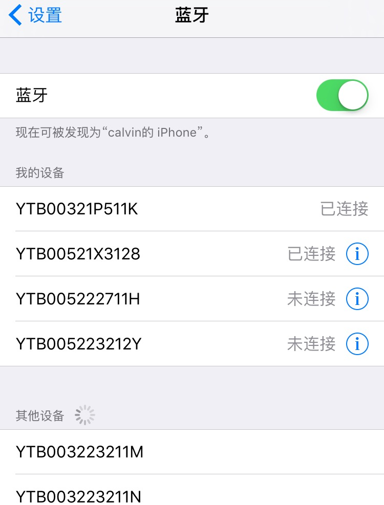

# 基本介绍

## 蓝牙基础知识
iOS里面的蓝牙框架是**CoreBluetooth.framework**，官方文档链接在[这里](https://developer.apple.com/library/ios/documentation/NetworkingInternetWeb/Conceptual/CoreBluetooth_concepts/CoreBluetoothOverview/CoreBluetoothOverview.html#//apple_ref/doc/uid/TP40013257-CH2-SW1)。

这个框架只支持蓝牙4.0，所以iPhone 4s以上的设备才可以使用，而对应的iPhone蓝牙配件也必须具备蓝牙4.0。具备通话功能的手环还有蓝牙2.0或3.0的协议，这些配件是、只能跟iOS系统的蓝牙连接了，用CoreBluetooth是搜索不出设备的。

CoreBluetooth里面有两个重要的概念：Central和Peripheral，翻译过来就是中央和外设，也就是指iPhone和手环。

Central的功能主要是扫描Peripheral，连接Peripheral，还有iPhone的蓝牙状态管理。这里着重说明一下：iOS的蓝牙功能只能通过用户手动开启或关闭，不能通过写代码的方式来开启或关闭，但是你可以收到开启或关闭的回调。


Peripheral在没有连接的情况下会一直广播，包含部分信息，比如名字、服务(Service)，就像某个人在大街上喊“我是张三，会Java开发”。服务(Service)其实就是功能，具备唯一标识符UUID。蓝牙联盟有一些标准的服务，比如心率，它的UUID是"180D"。服务通常包含一些特征(Characteristic)，这是用来数据通讯的通道，发送数据、接收数据都在这里进行，比如标准心率服务下面的特征是“2A37”。


我们可以用网络通讯的方式来更好理解蓝牙通讯，虽然有点不严谨：
- Central是客户端
- Peripheral是服务器
- Sevice是指HTTP功能，FTP功能
- Characteristic是指端口，80端口是HTTP功能的


## LGBluetooth基本概念
一般来说，App和手环要进行通讯需要经过这几个步骤：
1. 搜索设备
2. 连接设备
3. 查找服务
4. 查找特征
5. 开启特征的通知功能
6. 发送数据
7. 接收数据

CoreBluetooth里面的方法调用有10几个，为了简化操作，将其封装在两个类里面：
- LGCentralManager，对应CoreBluetooth的CBCentralManager
- LGPeripheral，对应CoreBluetooth的CBPeripheral

### LGCentralManager
LGCentralManager是个单例，因为对整个App来说，中央就是手机，主要功能就是一个：搜索LGPeripheral对象。

首先在程序启动时调用类方法`+ (void)startUp`，做一些初始化操作。

```Objective-C
#import "LGCentralManager.h"
@implementation LGAppDelegate

- (BOOL)application:(UIApplication *)application didFinishLaunchingWithOptions:(NSDictionary *)launchOptions
{
    // Override point for customization after application launch.
    // Initialization of CentralManager
    [LGCentralManager startUp];
    return YES;
}

```

以后的方法调用请使用`+ (LGCentralManager *)sharedInstance`

### 搜索设备
按是否跟iPhone连接来区分的话，设备有两种类型
- 已连接的设备，不会广播数据
- 未连接的设备，会广播数据

如下图所示


已连接的设备可以通过retrieve两个方法获取，这两个方法是立即返回LGPeripheral对象数组的，不需要要花时间。
```
    //根据服务ID来获取设备
    NSArray *connectedPeripherals = [[LGCentralManager sharedInstance] retrieveConnectedPeripheralsWithServices:@[kDefaultServiceUUID]];

```
或
```
    //"93E69689-5FAB-6AFF-43B1-29FCA16C1FC6"是已经保存的LGPeripheral的UUIDString
    NSArray *connectedPeripherals = [[LGCentralManager sharedInstance] retrievePeripheralsWithIdentifiers:@[@"93E69689-5FAB-6AFF-43B1-29FCA16C1FC6"]];

```

未连接的设备可以通过scan方法来获取设备，需要传入服务ID参数。框架内有两个服务ID：
- kDefaultServiceUUID : 默认服务，一般使用这个就可以了
- kDFUServiceUUID : 固件升级服务，特殊用途，不要随意使用
用法一：
```
    //开始扫描设备
    [[LGCentralManager sharedInstance] scanPeripheralsWithServices:@[kDefaultServiceUUID]];
    //扫描3秒钟
    dispatch_after(dispatch_time(DISPATCH_TIME_NOW, (int64_t)(3 * NSEC_PER_SEC)), dispatch_get_main_queue(), ^{
        //停止扫描, 如果不停止，将会一直扫描，占用资源。
        [[LGCentralManager sharedInstance] stopScanForPeripherals];
        //扫描结束之后，可以直接读取peripherals属性获取LGPeripheral对象
        NSArray *scanedPeripherals = [LGCentralManager sharedInstance].peripherals;
    });
```
用法二：

```
    //这种扫描方式会自动超时停止扫描，不需要调用stopScanForPeripherals,在completion接收数据即可。
    [[LGCentralManager sharedInstance] scanPeripheralsWithServices:@[kDefaultServiceUUID] interval:3 completion:^(LGCentralManager *manager, NSArray *scanedPeripherals) {
        self.peripherals = scanedPeripherals;
        [self.tableView reloadData];
    }];
```

### 蓝牙状态更新
  可以通过监听`kCBCentralManagerStateNotification`通知key来获取变化，当用户关闭蓝牙或者打开蓝牙时会收到通知。
  
  
## LGPeripheral
LGPeripheral对象主要用到一些属性，其中的方法普通用户是用不到，因为被其代理类LGPeripheralAgent管理了。

主要属性介绍:
- connected:是否连接状态。可能是和系统蓝牙连接，也可能是和别的手机连接
-  UUIDString: 唯一标识符，iOS无法获取蓝牙设备的Mac地址，手机会分配一个唯一标识符来表示。但是不同的手机，即使是同一个手环设备，它的UUIDString也是不一样的
-  name: 设备名称，如果写了序列号，每个设备的name就是序列号
-  RSSI: 蓝牙信号强度，负整数，值越大，信号越好。

其他方法可以查看头文件`LGPeripheral.h`，里面有详细说明。

## LGPeripheralAgent
这是LGPeripheral的代理类，用于处理**断开重连**、查找服务、查找特征、发送数据、接收数据、**解析数据**。简单来说，LGPeripheralAgent是真正进行交互的类。

**解析数据**是LGPeripheralAgent最主要的功能，因为蓝牙通讯是二进制数据传输，一般用户很难看懂。

数据分成两类：
- 设备主动发送的数据：操作设备上的按钮或触摸屏幕，比如SOS、拍照、音乐控制等，App接收到进行处理即可，类似于iOS的Notification。
- App主动发送的数据：发送一条数据给设备，设备会返回数据给App，返回的数据有可能只有一条，也有可能很多条。类似于http网络请求的，客户端发送request，服务器会返回数据。

初始化Agent，内部有大约1秒钟的查找蓝牙服务特征的处理，所以不能立即调用其他方法，需要延时调用。

```
- (instancetype)initWithPeripheral:(LGPeripheral *)aPeripheral;
```
写数据方法：

```
- (void)writeData:(NSData *)aData
        intervals:(NSInteger)intervals
       completion:(void(^)(NSData *data, NSError *error))aCallback;
```
开启实时心率

```
- (void)enableRealTimeHeartRateUpdate:(BOOL)enable completion:(void(^)(NSError *error))completion;
```

### LGPeripheralAgentDelegate
设备主动发送的数据以及被解析成LGPeripheralAgentDelegate，只要实现此协议即可。此方法包括：
- 实时心率
- 相机控制
- 音乐控制
- 查找手机
- 拨打电话
- 挂断电话


##LGBaseCommand
蓝牙命令，这是一个基类，不能直接创建使用，需要继承它实现相关方法。一个命令代表一个功能，它有很多个子类，具体查看功能说明。

初始化可以使用下面方法，命令跟具体的设备相关，所以需要传入一个agent作为参数。
```
+ (instancetype)commandWithAgent:(LGPeripheralAgent *)agent;
- (instancetype)initWithPeripheralAgent:(LGPeripheralAgent *)agent;
```

发送命令
```
- (void)start;
```

取消命令
```
- (void)cancel;
```

它有两个方法需要子类实现：

第一个是 `- (NSData *)sendingData;`，命令需要发送的数据，二进制

第二个是`- (BOOL)handleWithResponseData:(NSData *)responseData error:(NSError *)error;
`设备返回数据接收的方法。设备可能只返回一次数据，或者连续不断的发送数据，所有数据都将经过这个方法, 请根据实际情况返回是否已完成接收。它的返回值代表是否接收完成所有数据，YES表示完成接收所有数据，NO表示还有数据需要接收。

### LGBaseSettingCommand
继承于LGBaseCommand，有些比较简单的命令，比如设置参数的，它只需要返回是成功或失败，不关心其他的。这些命令可以提取共同的方法合并起来，子类只需要实现:

```
- (NSData *)sendingData;
```

### LGCommandsQueue
命令队列类，可以批量添加LGBaseCommand的子类，然后一起执行。不需要持有对象，内部自动处理。

**这里的一起执行并不是指网络请求一样的并发，实际上内部是按照先后顺序挨个执行的。**这是因为蓝牙通道其实是阻塞式的，前面的数据还没处理完成，后面的数据如果来了，会把相关数据弄混淆。

基本使用如下，这是一个同步系统日历内容到手环的方法：
```
        LGCommandsQueue *chainCommands = [[LGCommandsQueue alloc] init];
        ///指定agent，所有命令都共用
        chainCommands.peripheralAgent = self.agent;
        
        EKEventStore* store = [[EKEventStore alloc] init];
        ///请求日历权限
        [store requestAccessToEntityType:EKEntityTypeEvent completion:^(BOOL granted, NSError *error) {
            if (granted) {
                //取当前时间一个月内的日历
                NSDate* startDate = [NSDate date];
                NSDate* endDate = [NSDate dateWithTimeInterval:3600 * 24 * 30 sinceDate:startDate];
                
                NSPredicate *predicate = [store predicateForEventsWithStartDate:startDate
                                                                        endDate:endDate
                                                                      calendars:nil];
                
                NSArray *events = [store eventsMatchingPredicate:predicate];
                ///最多5个日历
                NSUInteger count = events.count > 5 ? 5: events.count;
                for (int i = 0; i < count; i++) {
                    EKEvent *event =  events[i];
                    ///创建日历对象
                    LGCalendarEvent *ce = [[LGCalendarEvent alloc] initWithEKEvent:event atIndex:i];
                    ///创建日历命令对象
                    LGCalendarEventCmd *cmd = [[[LGCalendarEventCmd alloc] init] addCalendarEvent:ce success:nil failure:nil];
                    ///添加进队列里面
                    [chainCommands addCommandObject:cmd];
                }
                ///执行
                [chainCommands startWithCompletion:^(NSError *error){
                    [self showAlert:_commands[row] msg:error ? error.description: @"成功"];
                }];
            }
        }];
```
