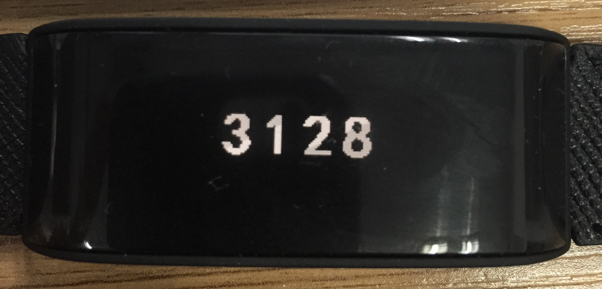

# 固件功能
## 读取序列号(LGSerialNumberCmd)
序列号是一个字符串，是设备的唯一标识符。在iOS世界里是不能获取蓝牙Mac地址的，这一点和Android有很大不同，Android是直接通过Mac地址来获取设备。

LGSerialNumberCmd就是用来读取序列号的，回调直接返回一个NSString。

使用方法如下：
```
LGSerialNumberCmd *cmd = [LGSerialNumberCmd commandWithAgent:self.agent];
[[cmd readSNWithSuccess:^(NSString *string) {
    //成功，保存string
} failure:^(NSError *error) {
    //失败，查看error.code是什么类型，进行处理
}] start];
```

## 读取版本和电量(LGFirmwareInformationCmd)
成功回调Block是LGFirmwareInformationBlock，有三个参数：
- bindingStatus （已废弃，自行管理绑定关系）
- batteryPower 电池电量，整数，百分比
- version  软件版本，格式是major.minor
```
typedef void(^LGFirmwareInformationBlock)(BOOL bindingStatus, NSInteger batteryPower, NSString *version);
```
使用方法如下:
```
LGFirmwareInformationCmd *cmd = [LGFirmwareInformationCmd commandWithAgent:self.agent];
[[cmd readFirmwareInformationWithSuccess:^(BOOL bindingStatus, NSInteger batteryPower, NSString *version) {
    //成功
} failure:^(NSError *error) {
    //失败，查看error.code是什么类型，进行处理
}] start];
```

## 读取配对码(LGPairingCodeCmd)
配对码是4个字符，数字或字母，每个设备的配对码是序列号的后四位，所以重复的概率很小。

当身边有很多同一产品类型的设备存在时，可以读取配对码来选择设备。发送这个命令之后，设备屏幕上一般会有下图一样的字符：


然后在App里面弹出输入框，让用户输入看到的4个字符。如果输入正确，即表示他手里的设备正是想要连接的设备，这时可以发送另外一个确认配对码的命令，即LGComfirmPairingCodeCmd。

使用方法如下:
```
LGPairingCodeCmd *cmd = [LGPairingCodeCmd commandWithAgent:self.agent];
[[cmd readCodeWithSuccess:^(NSString *string) {
    [self showAlert:_commands[row] msg: @"成功"];
} failure:^(NSError *error) {
    [self showAlert:_commands[row] msg:error.description];
}] start];
```

## 确认配对码(LGComfirmPairingCodeCmd)
和LGPairingCodeCmd是一起的，它的作用就是告诉设备退出配对码界面，不再显示配对码。
使用方法如下:
```
LGComfirmPairingCodeCmd *cmd = [LGComfirmPairingCodeCmd commandWithAgent:self.agent];
[cmd startWithSuccess:^{
    [self showAlert:_commands[row] msg: @"成功"];
} failure:^(NSError *error) {
    [self showAlert:_commands[row] msg: error.description];
}];
```

## 恢复出厂设置(LGRestoreFactorySettingsCmd)
所有数据、时间都将被清空，如需再次使用设备，请做相关设置。

使用方法如下:
```
LGRestoreFactorySettingsCmd *cmd = [LGRestoreFactorySettingsCmd commandWithAgent:self.agent];
[cmd startWithSuccess:^{
    [self showAlert:_commands[row] msg: @"成功"];
} failure:^(NSError *error) {
    [self showAlert:_commands[row] msg: error.description];
}];
```

## 进入升级模式(LGFirmwareUpgradeCmd)
不需要处理这个类，请看[软件更新](upgrade.md)部分