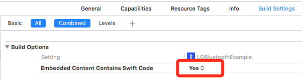

# 软件更新(LGDFUManager)
智能手环、手表也有一个操作系统在里面，也需要升级更新系统。

在example里面，已经有一个例子，其中的核心就是`LGDFUManager`类。

`LGDFUManager`依赖[DFULibrary](https://github.com/NordicSemiconductor/IOS-DFU-Library)，这个库使用swift 2.2写的，支持carthage和pod。如果你的项目是用Objective-C写的，请将`Embedded Content Contains Swift Code`选择为`YES`。




## 升级流程
1. 首先进入升级模式，使用命令`LGFirmwareUpgradeCmd`
2. 发送升级命令大约3秒后，设备会自动重启，此时已变成另外一个设备了，前后两者的Mac地址是不同的。
3. 搜索名称带有"OTA",服务包含`kDFUServiceUUID`的设备
4. 使用扫描出来信号最好的`LGPeripheral`的`cbPeripheral`属性初始化`DFUServiceInitiator`
5. 开始发送数据给设备
6. 升级完成


**中间会断开一次，重复3之后的步骤**

## 使用方法
首先使用LGPeripheralAgent进行初始化，里面执行了`[UIApplication sharedApplication].idleTimerDisabled = YES;`，防止自动休眠。

```
- (instancetype)initWithPeripheralAgent:(LGPeripheralAgent *)agent;
```
delloc的时候`idleTimerDisabled`会自动恢复为NO

然后传入固件文件URL开始升级
```
- (void)startWithfileURL:(NSURL *)fileURL
```

实现协议LGDFUManagerDelegate，里面包含进度、完成、错误的信息

```
/**
 *  进入升级模式成功
 *
 */
- (void)DFUManagerEnterUpgradeMode:(LGDFUManager *)manager;

/**
 *  当前的升级进度更新
 *
 *  @param manager  LGDFUManager
 *  @param progress 百分比，当返回100时还不是真正结束，请在`DFUManagerCompleted:`回调处理结束
 */
- (void)DFUManager:(LGDFUManager *)manager onUploadProgress:(NSInteger)progress;

/**
 *  完成升级
 */
- (void)DFUManagerCompleted:(LGDFUManager *)manager;

/**
 *  有错误发生
 *
 *  @param manager   LGDFUManager
 *  @param message   错误描述
 */
- (void)DFUManager:(LGDFUManager *)manager didErrorOccurWithMessage:(NSString *)message;
```

Demo的**LGFirmwareViewController**里面实现了这一功能，请查看相关使用方法。


## 注意事项
- 软件升级包是zip格式，请勿随意解压再压缩，可能导致文件有损坏。
- 升级过程中，尽量不要移动手机和手环，避免因信号中断导致升级终止。抑或App进入后台，导致App休眠。